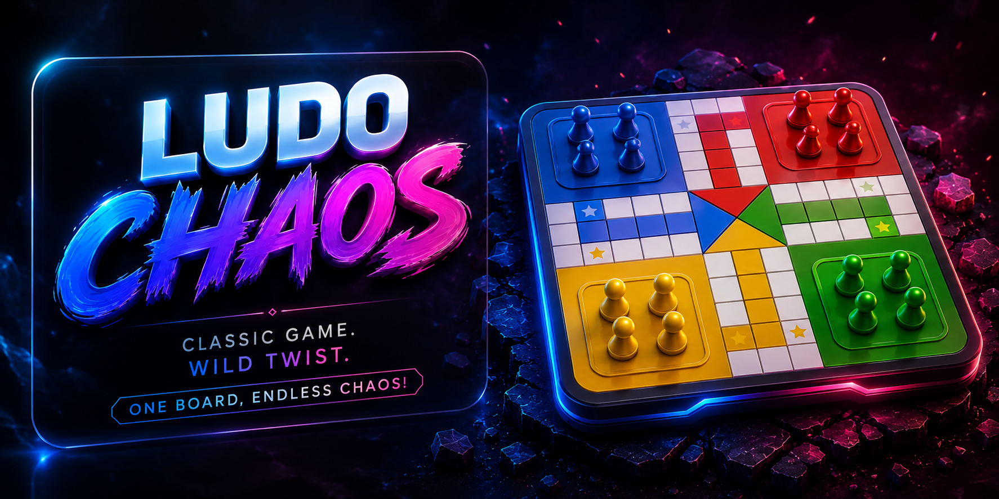

# Ludo Chaos

[](https://ludochaos.com)
[](LICENSE)
[](https://developer.mozilla.org/en-US/docs/Web/JavaScript)
[](https://workers.cloudflare.com)

[](https://ludochaos.com)

A feature-rich browser Ludo game with two distinct rule sets, real-time online multiplayer, an AI opponent, and full profile customization — all in vanilla HTML, CSS, and JavaScript with no build step and no frameworks.

---

## Features

- **Two game modes** — Classic (traditional Ludo rules) and Chaos (random tile events that can boost, trap, teleport, or swap your tokens)
- **Online multiplayer** — Real-time 2–4 player games via Firebase Realtime Database using deterministic replay; only player inputs are synced, never raw game state
- **AI opponent** — Three difficulty levels (Easy / Normal / Hard) powered by a pure heuristic scoring engine; no external library
- **Double-six reversal** — Rolling double 6 in either mode offers a choice to reverse direction for 4 moves, with per-pin gate logic for tokens that overshoot their starting square going backward
- **Profile & customization** — Display name, tagline, emoji or photo avatar, favourite colour, accent theme, and gameplay preferences, all persisted to `localStorage`
- **Google Sign-In** — Firebase Auth popup flow with photo synced to the player profile
- **Synthesized sound** — All sound effects are generated live via the Web Audio API; no audio files ship with the project
- **Animated landing board** — The home page runs a self-playing demo game reusing the real board renderer
- **Cloudflare Workers deployment** — Pure static asset bundle served at the edge with no origin server

---

## Live Demo

**[ludochaos.com](https://ludochaos.com)**

---

## Game Modes

### Classic
Standard Ludo rules: roll a 6 to leave base, travel the full loop, and reach the home stretch. An exact roll (or under) is always required to finish — no overshooting. The double-six reversal rule applies.

### Chaos
Everything in Classic, plus chaos tiles scattered around the board that trigger random events when landed on:

| Event | Effect |
|-------|--------|
| **Boost** | Jump forward several cells |
| **Teleport** | Warp to a random safe position |
| **Trap** | Lose one or more turns |
| **Swap** | Exchange places with another player's token |

In Chaos mode, a global gate also applies: all tokens are blocked from entering the home stretch until the player has captured at least one opponent token.

---

## Tech Stack

| Layer | Choice |
|-------|--------|
| Language | Vanilla JavaScript (ES5/ES6, no modules) |
| Styling | Vanilla CSS with custom properties |
| Realtime backend | Firebase Realtime Database (compat SDK v10) |
| Auth | Firebase Authentication (Google Sign-In) |
| Deployment | Cloudflare Workers (static asset bundle) |
| Smooth scroll | Lenis (CDN) |
| Build step | None |

---

## Getting Started

### Prerequisites

- Any modern browser
- Node.js (only for the local dev server convenience script)

### Run locally

```bash
npx http-server -p 8123 -c-1
```

Then open [http://localhost:8123](http://localhost:8123).

No install, no compile, no watch process. Edit a file and reload.

### Start a game from the console

On `play.html`, open DevTools and run:

```js
numPlayers = 4; vsAI = true; selMode = 'classic'; startGame();
// or
numPlayers = 2; vsAI = false; selMode = 'chaos'; startGame();
```

---

## Project Structure

```
ludochaos/
├── index.html          # Landing page (animated self-playing intro board)
├── play.html           # Game shell — start menu, live board, all overlays
├── profile.html        # Profile and preference customization
├── about.html
├── contact.html
├── privacy.html
├── terms.html
├── 403.html / 404.html / 500.html
│
├── css/
│   ├── base.css        # Design tokens, CSS variables, global layout
│   ├── board.css       # 15×15 grid, token pins, player corner cards
│   ├── start-screen.css
│   ├── overlay.css     # In-game overlays (dice, reverse, win, etc.)
│   ├── navbar.css
│   ├── pages.css       # Shared page card layout + profile controls
│   ├── online.css      # Lobby, waiting room, countdown overlay
│   └── auth.css        # Auth modal
│
├── js/
│   ├── config.js       # Static geometry: TRACK, PLAYERS, SAFE, CHAOS_TILES
│   ├── helpers.js      # globalIndex(), playerDir(), coordinate utilities
│   ├── prefs.js        # localStorage-backed settings singleton (loaded first)
│   ├── state.js        # G object — single source of truth for live game state
│   ├── board.js        # Static board grid builder
│   ├── render.js       # Token layer + player corner card renderer
│   ├── turns.js        # beginTurn / doRoll / die-click handling
│   ├── moves.js        # canMove() validation + applyMove() state mutation
│   ├── animate.js      # commitMove() — step-by-step token animation
│   ├── resolution.js   # endResolution() — extra turn or pass to next player
│   ├── ai.js           # Heuristic AI with three difficulty levels
│   ├── reverse.js      # Double-six direction reversal rule
│   ├── winner.js       # Win screen and stats recording
│   ├── guard.js        # Leave-game navigation guard
│   ├── online.js       # Firebase Realtime Database — deterministic replay
│   ├── firebase-config.js
│   ├── auth.js         # Auth singleton + Google Sign-In + auth modal UI
│   ├── nav.js          # Shared navbar/footer injected on every page
│   ├── landing.js      # Animated self-playing intro board (index.html only)
│   ├── profile.js      # Profile page preference wiring
│   ├── theme.js        # Reads Prefs and sets data-accent/data-theme on load
│   ├── sound.js        # Web Audio synthesizer — no audio files
│   ├── smooth.js       # Lenis smooth scroll initializer
│   └── transition.js   # Neon progress bar + View Transitions API fallback
│
├── robots.txt
├── sitemap.xml
├── wrangler.jsonc      # Cloudflare Workers deployment config
└── .assetsignore       # Excludes dev files from the public bundle
```

### Three coordinate systems

A token's location is expressed three ways — understanding the conversions between them is the core architectural challenge:

1. **Logical position** `tok.pos` (0–56): per-player, relative to that player's own start
2. **Global track index** (0–51): `(PLAYERS[player].start + pos) % 52` — used for collision/capture detection
3. **Grid cell** `[row, col]` on the 15×15 board: mapped from logical position by `posToCell()`

### State vs. animation separation

`applyMove()` mutates `G` to the **final** result immediately. The visual walk in `animate.js` happens around that — purely cosmetic and must never change `G`. This keeps gameplay correctness isolated in the move/resolution layer.

---

## Deployment

The project deploys as a static asset bundle on Cloudflare Workers:

```bash
npx wrangler deploy
```

`wrangler.jsonc` configures the asset directory and 404 handling. `.assetsignore` excludes dev files (`.claude/`, `CLAUDE.md`, `DESIGN.md`, `wrangler.jsonc`) from the public bundle.

---

## Contributing

Issues and pull requests are welcome. For significant changes, please open an issue first to discuss the approach.

1. Fork the repository
2. Create a feature branch (`git checkout -b feat/your-feature`)
3. Commit with [conventional commits](https://www.conventionalcommits.org/) (`feat:`, `fix:`, `docs:`, etc.)
4. Open a pull request

---

## License

[MIT](LICENSE) — Atharva Shukla, 2026
